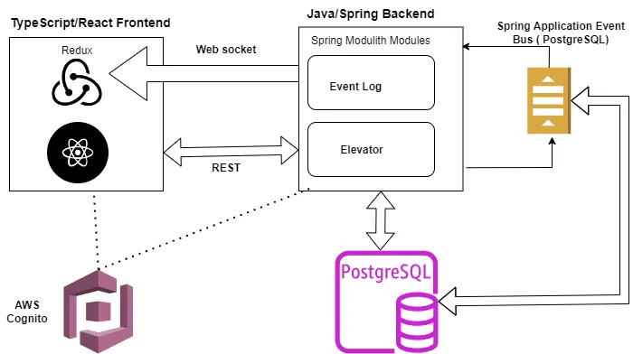
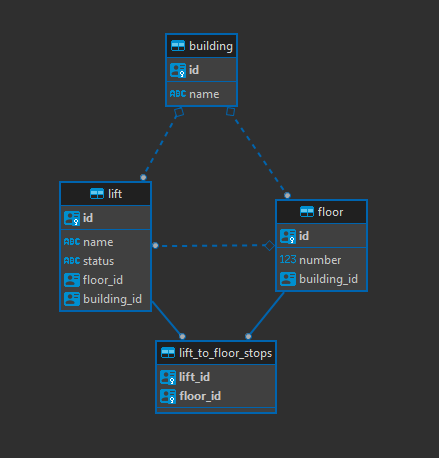
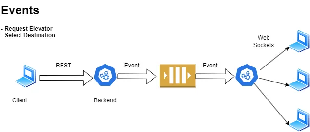

# Elevator System

### Technologies used

#### Frontend

- [React](https://react.dev/)
- TypeScript
- [Redux Toolkit](https://redux-toolkit.js.org/) is used for state management
- [MUI](https://mui.com/material-ui/getting-started/) is as component library
- React Router
- [React Stomp hooks](https://github.com/SvenKirschbaum/react-stomp-hooks) is used to manage Websockets connection.

#### Backend

- Spring Boot 3
- Spring Data JPA
- [Spring Modulith](https://docs.spring.io/spring-modulith/reference/)
  - String Modulith is used to isolate the event log and elevator modules from each other.
- [STOMP Over WebSocket](https://jmesnil.net/stomp-websocket/doc/)
  - [Article on this topic](https://hpcodes.medium.com/send-messages-from-spring-boot-backend-to-reactjs-app-using-websocket-4120f6979c9b)
- PostgreSQL
- Flyway, MapStruct, Lombok, TestContainers, Junit and more

#### Authentication and Authorization (Work in progress)

- [AWS Cognito](https://aws.amazon.com/cognito/)
- Spring Security

#### Infrastructure

- AWS CDK

### Elevator Database Schema

### General Working

#### Features

- **Up/Down Buttons:** Users can request the elevator by pressing up or down buttons on each floor.
- **Inside Control Panel:** Allows passengers to select their destination floor.
- **Floor Request Handling:**
  - Keeps track of all floor requests and processes them in an optimized order.
  - Determines the best order for servicing requests.
  - Prioritize requests based on direction, current elevator location, and other factors.
- **Admin view**
  - Allows Admin to view all required info at 1 place
  - Event logs
  - Floor stops

#### Video

##### Example with 1 Lift

##### Example with 2 Lift

#### General flow description

- Typically, interactions between the front-end and back-end are handled through a RESTful API.
- However, for actions related to the elevator, an asynchronous event-driven approach is employed.
  - This approach enables real-time updates on the elevator's status.

